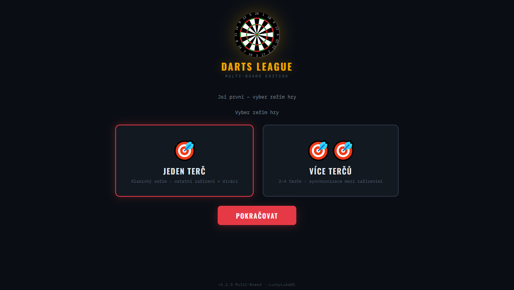
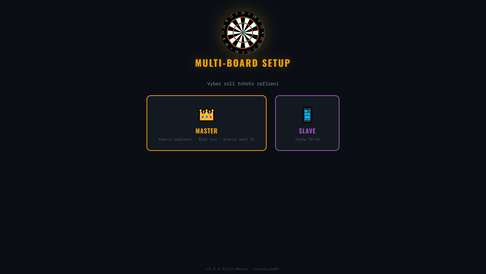
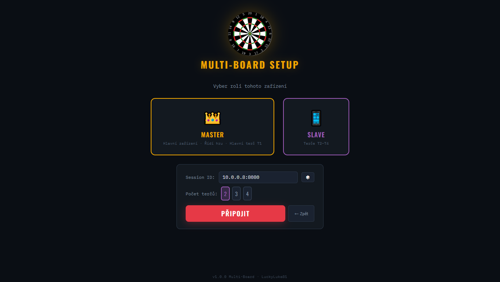
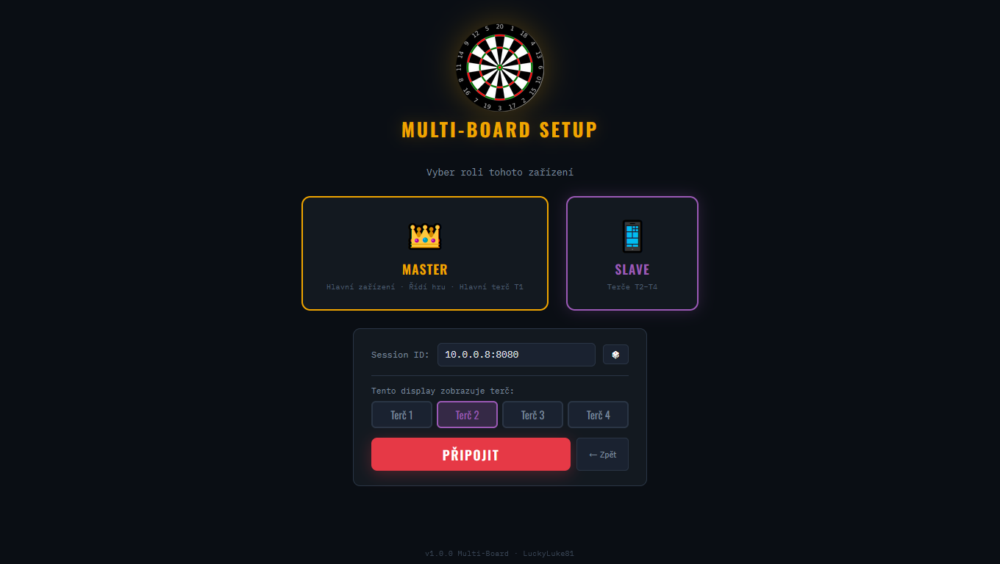
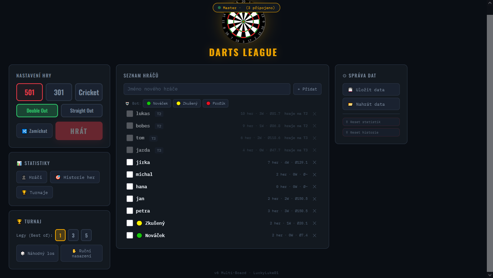
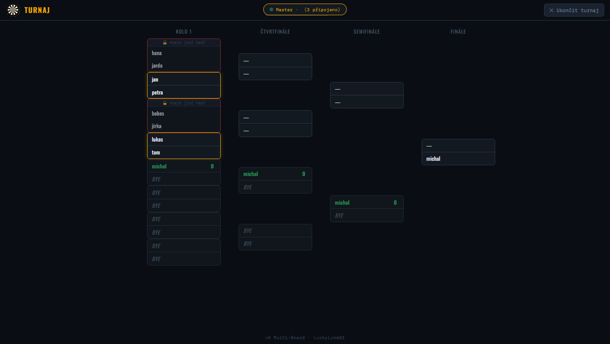
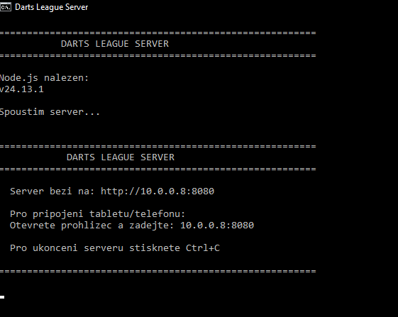

🎯 Darts League – Šipková liga & Darts Scoreboard (CZ)

Webová aplikace pro vedení šipkařské ligy a zápasů. Běží lokálně na PC (Node.js server) a umí zobrazovat více terčů současně na dalších zařízeních v síti (telefony/tablety).

Pokud hledáte aplikaci jen pro jeden terč je zde: https://github.com/lukasjicha/sipkova-liga-darts-scoreboard.git

## Co to umí

### Herní režimy
- **501 / 301** (klasické odpočítávání)
- **Cricket**
- **Turnaje** (pavouk / bracket)

### Multi‑board (až 4 terče)
- **T1–T4** 
- **Master = vždy T1** (řídí hru, nastavuje počet terčů)
- **Slave  = T2–T4 nebo sledující ** (v případě více terčů ovladá svuj terč, pokud je jen jeden terč je pouze sledující)
- **Automatická synchronizace počtu terčů** 
- **Claim terče**: server hlídá, aby si dva displeje nevzaly stejný terč
- **Zámky hráčů**: hráč nemůže být vybraný na dvou terčích zároveň (zamezí chybám)

### UI a pohodlí
- **Funguje na mobilu/tabletu** (responzivní rozložení, bez nutnosti posouvat kritické ovládání)
- **Fullscreen** (užitečné pro TV)
- **Zvuk / „hospodský mód“** (hlášky, emoce – CZ)
- **Import / export dat** do **JSON** (záloha, přenos na jiné zařízení)

   

## Rychlý start (Windows)

### 1) Požadavky
- Windows PC
- **Node.js LTS** (https://nodejs.org)

### 2) Spuštění
1. Otevři složku `darts-server-node`
2. Dvojklik na **`DartsServer.bat`**
   - při prvním spuštění se nainstalují závislosti (`npm install`)
3. V prohlížeči se otevře hra
4. V konzoli uvidíš IP adresu pro ostatní zařízení (např. `192.168.1.50:8080`)

### 3) Připojení telefonu/tabletu
1. Telefon/tablet musí být na stejné Wi‑Fi
2. Otevři prohlížeč a zadej adresu z PC (např. `http://192.168.1.50:8080`)
3. Pokud master zvolil jeden terč jses sledující 
4. Pokud zvolil master více terčů vybíráš si číslo terče

## Jak používat jeden terč (doporučený postup)

1. Na PC otevři aplikaci → **Jeden terč ** → jseš Master → ovládáš hru 
2. Ostatní připojení jsou jen sledující a nemohou zasahovat. 

## Jak používat Více terčů (doporučený postup)

1. Na PC otevři aplikaci → **Více terčů ** → jseš Master → ovládáš hru a terč 1 
2. Na dalších zařízeních otevři stejnou IP → **T2/T3/T4** → vyber volný terč → ovladáš svuj terč
3. Při výběru hráčů se automaticky hlídá:
   - hráč není na více terčích zároveň
   - terč není obsazený dvěma displeji
4. Pokud master spustí Turnaj tak si vybíraš dvojici na svůj terč

## Struktura projektu
- `server.js` – Node.js server + WebSocket synchronizace
- `static/index.html` – celá aplikace (HTML + CSS + JS v jednom souboru)
- `DartsServer.bat` – pohodlné spuštění pro Windows
- `package.json` – závislosti

## Export / Import dat
V aplikaci je sekce **Správa dat**:
- **Export** vytvoří JSON zálohu
- **Import** načte JSON zpět (přenos na jiné PC, archiv ligy)

## Troubleshooting
- **Telefon se nepřipojí / timeout**: zkontroluj firewall/antivir (např. ESET) a povol přístup pro Node.
- **Něco nejde po update**: hard reload (Ctrl+F5) nebo otevři v anonymním okně.
- **Dva displeje na stejném terči**: server to zamítne a nabídne volný terč (claim systém).

## Licence
Projekt je zdarma k použití.

Pokud si ho upravíš nebo vylepšíš, klidně si ho forkni.

